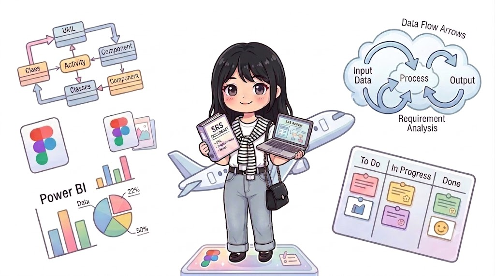

# Hi, I'm Towmiess - (Tran Thi Quynh Thom) 👩‍💼

  

 

---

### 🙋‍♀️ About Me

- 👩‍💻 My name is **Tran Thi Quynh Thom**
- 🎓 IT · Posts & Telecommunications Institute of Technology (PTIT)
- 📊 **IT Business Analyst** — passionate about bridging business needs and technical execution
- 🔍 I enjoy digging into requirements and translating complexity into clear solutions that teams can actually build
- 🌱 Currently exploring: **ERP · Healthtech · EdTech · Fintech · AI-powered products**
- 📫 Reach me at: [quynhthom.work@gmail.com](mailto:quynhthom.work@gmail.com)

---

### 🛠 BA Toolset

  
  
  
  
  

 

### 📊 Data & Analysis

  
  
  
  
  

 

### ⚙️ Tech Exposure

  
  
  
  
  

---

---

  <i>Always eager to learn, grow, and contribute valuable insights to the team's success 🚀</i>

